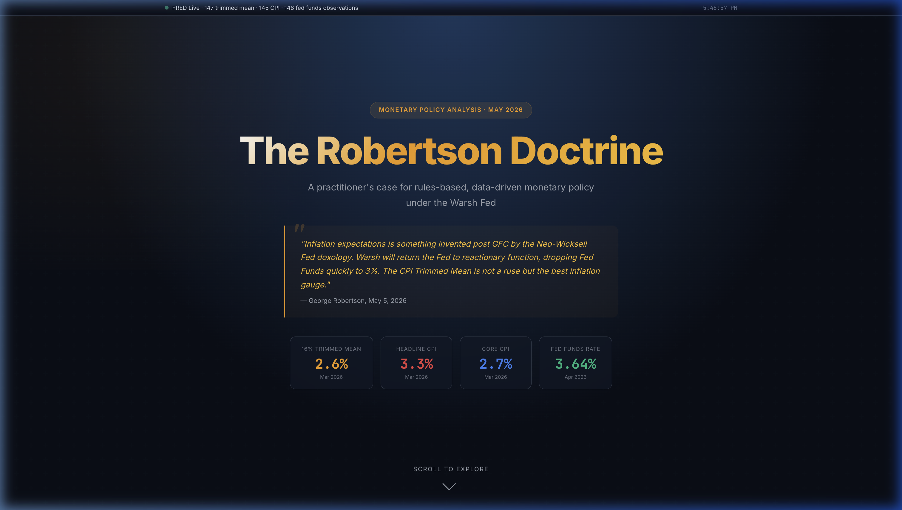

# The Robertson Doctrine — Interactive Fed Analysis

[](https://21e8-miner.github.io/robertson-doctrine/)
[](https://opensource.org/licenses/MIT)

> **"A rules-based policy under a Warsh Fed requires a reactionary function, not just a forecast."** — *Robertson Doctrine, May 2026*

This production-grade quantitative dashboard provides real-time analysis of U.S. inflation metrics. Optimized for **High Performance** and **Static-First** delivery via GitHub Pages, it features a professional WSJ-inspired aesthetic and instant data ingestion.



---

## ⚡ High Performance Architecture

To solve the slow loading times of cloud containers, this dashboard uses a **Dual-Mode Data Pipeline**:

1.  **Direct Static Mode (Production):** Fetches live FRED data directly in the browser via a CORS proxy. This allows for near-instant loading on GitHub Pages with no backend container boot time.
2.  **Server Mode (Local Dev):** Includes a robust Node.js/Express backend for local development, caching, and offline fallbacks.

---

## 📊 Live Data Integration

All analysis is powered by real-time data fetched from **FRED** (Federal Reserve Economic Data, St. Louis Fed):

| Series | FRED ID | Description |
|--------|---------|-------------|
| 16% Trimmed Mean CPI | `TRMMEANCPIM159SFRBCLE` | Year-over-year %, seasonally adjusted |
| Headline CPI | `CPIAUCSL` | CPI-U all items index (YoY computed in-app) |
| Core CPI | `CPILFESL` | CPI-U less food & energy (YoY computed in-app) |
| Fed Funds Rate | `FEDFUNDS` | Effective federal funds rate, monthly avg |

---

## 💎 Features

### 📊 Professional Inflation Analysis
- **WSJ Aesthetic:** Sophisticated "Financial Paper" theme with serif typography (Lora) and muted professional palettes.
- **Interactive Charts:** Date-range zooming (10-year, 4-year, 1-year) with legend-based data toggling.
- **Spread Analysis:** Visualization of the gap between Headline and Trimmed Mean CPI to detect transitory shocks.

### 🧮 Taylor Rule Workbench
- Pre-populated with live trimmed mean inflation.
- Real-time variants: Classic Taylor (1993), Yellen Balanced (2015), and Warsh Aggressive.
- Shows prescribed vs. actual rates with live gap detection.

### 🪙 FOMC decision Simulator
- A data-dependent simulation of the 2026 FOMC meeting calendar.
- Tracks simulated rate paths vs. Robertson's 3.0% terminal target.

---

## 🚀 Quick Start (Local Development)

```bash
# Clone the repo
git clone https://github.com/21e8-miner/robertson-doctrine.git
cd robertson-doctrine

# Install dependencies
npm install

# Start the dev server
npm start
```

Open **http://localhost:8420** to view the dashboard with local caching enabled.

---

## 📖 The Robertson Thesis

> *"Inflation expectations is something invented post GFC by the Neo-Wicksell Fed doxology. Warsh will return the Fed to reactionary function, dropping Fed Funds quickly to 3%. The CPI Trimmed Mean is not a ruse but the best inflation gauge."* — George Robertson, May 5, 2026

The 16% trimmed mean CPI (Cleveland Fed) strips the highest and lowest 8% of components by monthly price change — removing pandemic-era outliers and energy spikes symmetrically. Robertson argues that with trimmed mean trending toward **2.6%**, the Fed has meaningful room to ease toward a neutral rate of ~3%.

---

## 📜 License & Credits

- **License:** MIT © 2026 Robertson Doctrine Project
- **Data:** St. Louis Fed (FRED), Cleveland Fed, BLS.
- **Design:** Inspired by the *Wall Street Journal* institutional reporting style.

> **Disclaimer:** Not investment advice. This dashboard is for educational and research purposes only.
